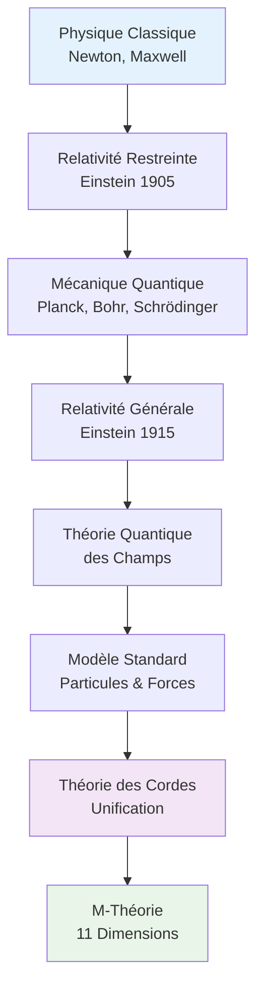

<div className="math-container">

## 🎻 La Musique de l'Univers

La **Théorie des Cordes** représente l'apogée de la physique théorique moderne, où les particules élémentaires deviennent des **cordes vibrantes** dans un espace-temps de dimension supérieure. Cette théorie unifie la mécanique quantique et la relativité générale dans une symphonie mathématique d'une beauté extraordinaire.

</div>

{/* truncate */}

## 🌌 L'Évolution Conceptuelle



## 🎯 Les Fondements Mathématiques

### 1. **Action de Nambu-Goto**

L'action qui décrit la dynamique d'une corde est donnée par :

```
S_NG = -T ∫ d²σ √(-det(γ))
```

où :
- T est la **tension de la corde**
- γ_αβ est la métrique induite sur la surface d'univers de la corde
- σ⁰, σ¹ sont les coordonnées sur la surface d'univers

### 2. **Action de Polyakov**

Une formulation plus maniable utilise l'action de Polyakov :

```
S_P = -(T/2) ∫ d²σ √(-h) h^(αβ) ∂_α X^μ ∂_β X^ν g_μν
```

où h_αβ est une métrique auxiliaire sur la surface d'univers.

## 🔬 Visualisation des Vibrations de Cordes

```python
import numpy as np
import matplotlib.pyplot as plt
from mpl_toolkits.mplot3d import Axes3D
import matplotlib.animation as animation

def string_vibration_visualization():
    """Visualisation des modes de vibration d'une corde"""
    
    # Paramètres de la corde
    L = 2 * np.pi  # Longueur de la corde
    c = 1.0        # Vitesse de propagation
    modes = [1, 2, 3, 4]  # Modes de vibration
    
    # Grille spatiale et temporelle
    x = np.linspace(0, L, 100)
    t = np.linspace(0, 4*np.pi, 200)
    X, T = np.meshgrid(x, t)
    
    fig, axes = plt.subplots(2, 2, figsize=(15, 12))
    axes = axes.ravel()
    
    for i, n in enumerate(modes):
        ax = axes[i]
        
        # Mode de vibration
        omega_n = n * np.pi * c / L
        Y = np.sin(n * np.pi * X / L) * np.cos(omega_n * T)
        
        # Contour plot
        contour = ax.contourf(X, T, Y, levels=20, cmap='RdBu_r')
        ax.set_title(f'Mode de Vibration n = {n}\nω = {omega_n:.2f}')
        ax.set_xlabel('Position x')
        ax.set_ylabel('Temps t')
        plt.colorbar(contour, ax=ax)
    
    plt.tight_layout()
    plt.show()

# Animation 3D d'une corde vibrante
def animate_string_3d():
    """Animation 3D d'une corde vibrante"""
    
    fig = plt.figure(figsize=(12, 8))
    ax = fig.add_subplot(111, projection='3d')
    
    # Paramètres
    L = 2 * np.pi
    n_modes = 3
    x = np.linspace(0, L, 50)
    
    def animate(frame):
        ax.clear()
        t = frame * 0.1
        
        # Combinaison de plusieurs modes
        y = np.zeros_like(x)
        z = np.zeros_like(x)
        
        for n in range(1, n_modes + 1):
            amplitude = 1.0 / n
            frequency = n * np.pi / L
            phase = t * n
            
            y += amplitude * np.sin(frequency * x) * np.cos(phase)
            z += amplitude * np.sin(frequency * x) * np.sin(phase)
        
        # Tracé de la corde
        ax.plot(x, y, z, 'b-', linewidth=2)
        
        # Configuration de l'axe
        ax.set_xlim(0, L)
        ax.set_ylim(-2, 2)
        ax.set_zlim(-2, 2)
        ax.set_xlabel('Position')
        ax.set_ylabel('Amplitude Y')
        ax.set_zlabel('Amplitude Z')
        ax.set_title(f'Corde Vibrante - Temps t = {t:.2f}')
    
    anim = animation.FuncAnimation(fig, animate, frames=200, interval=50, blit=False)
    return anim

# Exécution des visualisations
string_vibration_visualization()
anim = animate_string_3d()
plt.show()
```

## 🎼 Spectre de Masse des Cordes

La théorie des cordes prédit un spectre de masse discret pour les particules :

```python
def string_spectrum_calculation():
    """Calcul du spectre de masse des cordes"""
    
    # Paramètres de base
    alpha_prime = 1.0  # Constante de Regge
    T = 1.0 / (2 * np.pi * alpha_prime)  # Tension de la corde
    
    # Modes de vibration
    n_modes = 20
    modes = range(1, n_modes + 1)
    
    # Calcul des masses (en unités naturelles)
    masses_squared = []
    for n in modes:
        # Masse au carré = (niveau d'excitation - 1) / alpha_prime
        m_squared = (n - 1) / alpha_prime
        masses_squared.append(m_squared)
    
    masses = np.sqrt(np.array(masses_squared))
    
    # Visualisation du spectre
    plt.figure(figsize=(12, 8))
    
    # Diagramme des niveaux d'énergie
    plt.subplot(2, 1, 1)
    plt.stem(modes, masses, basefmt=' ')
    plt.xlabel('Niveau d\'excitation n')
    plt.ylabel('Masse m')
    plt.title('Spectre de Masse des Cordes')
    plt.grid(True, alpha=0.3)
    
    # Relation masse-spin (Regge)
    plt.subplot(2, 1, 2)
    spins = np.array(modes) - 1
    plt.plot(spins, masses_squared, 'o-', markersize=8)
    plt.xlabel('Spin J')
    plt.ylabel('Masse² (m²)')
    plt.title('Trajectoire de Regge : m² = J/α\'')
    plt.grid(True, alpha=0.3)
    
    plt.tight_layout()
    plt.show()
    
    return masses, modes

masses, modes = string_spectrum_calculation()
```

## 🌟 Compactification et Dimensions Extra

L'une des prédictions les plus fascinantes de la théorie des cordes est l'existence de **dimensions spatiales supplémentaires** :

```python
def compactification_visualization():
    """Visualisation de la compactification des dimensions extra"""
    
    from matplotlib.patches import Circle
    
    fig, axes = plt.subplots(2, 2, figsize=(15, 12))
    
    # 1. Dimension compacte - Cercle
    ax1 = axes[0, 0]
    circle = Circle((0, 0), 1, fill=False, linewidth=3, color='blue')
    ax1.add_patch(circle)
    ax1.set_xlim(-2, 2)
    ax1.set_ylim(-2, 2)
    ax1.set_aspect('equal')
    ax1.set_title('Compactification sur S¹')
    ax1.grid(True, alpha=0.3)
    
    # 2. Torus T²
    ax2 = axes[0, 1]
    # Tracé d'un tore simplifié
    u = np.linspace(0, 2*np.pi, 50)
    v = np.linspace(0, 2*np.pi, 50)
    U, V = np.meshgrid(u, v)
    
    R = 2  # Rayon majeur
    r = 0.5  # Rayon mineur
    
    x = (R + r * np.cos(V)) * np.cos(U)
    y = (R + r * np.cos(V)) * np.sin(U)
    z = r * np.sin(V)
    
    ax2 = fig.add_subplot(2, 2, 2, projection='3d')
    ax2.plot_surface(x, y, z, alpha=0.7, cmap='viridis')
    ax2.set_title('Compactification sur T²')
    
    # 3. Variété de Calabi-Yau
    ax3 = axes[1, 0]
    # Approximation simple d'une variété de Calabi-Yau
    t = np.linspace(0, 4*np.pi, 100)
    x = np.cos(t) * (1 + 0.3 * np.cos(3*t))
    y = np.sin(t) * (1 + 0.3 * np.cos(3*t))
    z = 0.3 * np.sin(3*t)
    
    ax3 = fig.add_subplot(2, 2, 3, projection='3d')
    ax3.plot(x, y, z, 'b-', linewidth=2)
    ax3.set_title('Variété de Calabi-Yau (Simplifiée)')
    
    # 4. Espace-temps avec dimensions extra
    ax4 = axes[1, 1]
    
    # Espace 3D visible
    x_vis = np.array([0, 1, 1, 0, 0])
    y_vis = np.array([0, 0, 1, 1, 0])
    z_vis = np.array([0, 0, 0, 0, 0])
    
    ax4 = fig.add_subplot(2, 2, 4, projection='3d')
    ax4.plot(x_vis, y_vis, z_vis, 'r-', linewidth=3, label='Espace 3D visible')
    
    # Dimensions compactes
    for i in range(3):
        x_compact = np.array([0, 0.2, 0.2, 0, 0]) + i * 0.3
        y_compact = np.array([0, 0, 0.2, 0.2, 0]) + i * 0.3
        z_compact = np.array([0, 0, 0, 0, 0]) + i * 0.3
        ax4.plot(x_compact, y_compact, z_compact, 'b--', alpha=0.7)
    
    ax4.set_title('Dimensions Extra Compactifiées')
    ax4.legend()
    
    plt.tight_layout()
    plt.show()

compactification_visualization()
```

## 🔮 Dualités et Symétries

La théorie des cordes révèle des **dualités** profondes entre différentes descriptions :

```python
def duality_visualization():
    """Visualisation des dualités en théorie des cordes"""
    
    fig, axes = plt.subplots(2, 2, figsize=(15, 12))
    
    # 1. Dualité T (R ↔ 1/R)
    ax1 = axes[0, 0]
    R_values = np.logspace(-1, 1, 100)
    mass_spectrum = []
    
    for R in R_values:
        # Mode de vibration : m² = (n/R)²
        # Mode d'enroulement : m² = (wR)²
        n, w = 1, 1  # Nombres quantiques
        m_vibration = n / R
        m_winding = w * R
        total_mass = np.sqrt(m_vibration**2 + m_winding**2)
        mass_spectrum.append(total_mass)
    
    ax1.loglog(R_values, mass_spectrum, 'b-', linewidth=2)
    ax1.axvline(x=1, color='r', linestyle='--', alpha=0.7, label='R = 1 (auto-dual)')
    ax1.set_xlabel('Rayon de compactification R')
    ax1.set_ylabel('Masse du mode le plus léger')
    ax1.set_title('Dualité T : R ↔ 1/R')
    ax1.legend()
    ax1.grid(True, alpha=0.3)
    
    # 2. Dualité S (couplage faible ↔ fort)
    ax2 = axes[0, 1]
    g_values = np.logspace(-2, 2, 100)
    
    # Couplage effectif : g_eff = 1/g pour g >> 1
    g_eff = np.where(g_values < 1, g_values, 1/g_values)
    
    ax2.loglog(g_values, g_eff, 'g-', linewidth=2)
    ax2.axvline(x=1, color='r', linestyle='--', alpha=0.7, label='g = 1')
    ax2.set_xlabel('Couplage g')
    ax2.set_ylabel('Couplage effectif g_eff')
    ax2.set_title('Dualité S : g ↔ 1/g')
    ax2.legend()
    ax2.grid(True, alpha=0.3)
    
    # 3. Web de dualités
    ax3 = axes[1, 0]
    
    # Graphe des dualités
    theories = ['Type I', 'Type IIA', 'Type IIB', 'SO(32)', 'E8×E8', 'M-théorie']
    positions = {
        'Type I': (0, 0),
        'Type IIA': (1, 1),
        'Type IIB': (2, 1),
        'SO(32)': (0, -1),
        'E8×E8': (2, -1),
        'M-théorie': (1, 2)
    }
    
    # Connexions entre théories
    connections = [
        ('Type I', 'Type IIA'),
        ('Type IIA', 'Type IIB'),
        ('Type IIA', 'M-théorie'),
        ('Type IIB', 'M-théorie'),
        ('Type I', 'SO(32)'),
        ('Type IIB', 'E8×E8')
    ]
    
    for theory in theories:
        x, y = positions[theory]
        ax3.scatter(x, y, s=200, c='lightblue', edgecolors='blue', linewidth=2)
        ax3.text(x, y, theory, ha='center', va='center', fontweight='bold')
    
    for start, end in connections:
        x1, y1 = positions[start]
        x2, y2 = positions[end]
        ax3.plot([x1, x2], [y1, y2], 'k--', alpha=0.7)
    
    ax3.set_xlim(-0.5, 2.5)
    ax3.set_ylim(-1.5, 2.5)
    ax3.set_title('Web de Dualités en Théorie des Cordes')
    ax3.axis('off')
    
    # 4. Diagramme de phase
    ax4 = axes[1, 1]
    
    # Régions de validité des différentes descriptions
    g_strong = np.linspace(0, 2, 100)
    ls_small = np.linspace(0, 2, 100)
    
    # Supergravité (couplage faible)
    ax4.fill_between(g_strong, 0, 1, alpha=0.3, color='blue', label='Supergravité')
    
    # Théorie des cordes (couplage intermédiaire)
    ax4.fill_between(g_strong, 1, 2, alpha=0.3, color='green', label='Théorie des Cordes')
    
    # Théorie M (couplage fort)
    ax4.fill_between(g_strong, 1.5, 2, alpha=0.3, color='red', label='Théorie M')
    
    ax4.set_xlabel('Couplage de corde g_s')
    ax4.set_ylabel('Longueur de corde l_s')
    ax4.set_title('Diagramme de Phase des Théories')
    ax4.legend()
    ax4.grid(True, alpha=0.3)
    
    plt.tight_layout()
    plt.show()

duality_visualization()
```

## 🎭 Applications en Cosmologie

```python
def cosmology_string_theory():
    """Applications cosmologiques de la théorie des cordes"""
    
    fig, axes = plt.subplots(2, 2, figsize=(15, 12))
    
    # 1. Inflation et cordes
    ax1 = axes[0, 0]
    t = np.linspace(0, 10, 1000)
    
    # Expansion exponentielle
    a_inflation = np.exp(3 * t)  # Facteur d'échelle pendant l'inflation
    a_normal = 1 + 0.1 * t       # Expansion normale
    
    ax1.semilogy(t, a_inflation, 'r-', linewidth=2, label='Inflation (corde)')
    ax1.semilogy(t, a_normal, 'b-', linewidth=2, label='Expansion normale')
    ax1.axvline(x=3, color='g', linestyle='--', alpha=0.7, label='Fin de l\'inflation')
    
    ax1.set_xlabel('Temps')
    ax1.set_ylabel('Facteur d\'échelle a(t)')
    ax1.set_title('Inflation dans la Théorie des Cordes')
    ax1.legend()
    ax1.grid(True, alpha=0.3)
    
    # 2. Branes et dimensions extra
    ax2 = axes[0, 1]
    
    # Brane 3D dans un espace 5D
    x = np.linspace(-2, 2, 50)
    y = np.linspace(-2, 2, 50)
    X, Y = np.meshgrid(x, y)
    Z = np.zeros_like(X)
    
    ax2 = fig.add_subplot(2, 2, 2, projection='3d')
    ax2.plot_surface(X, Y, Z, alpha=0.7, color='blue', label='Brane 3D')
    
    # Dimension extra
    z_extra = np.linspace(-1, 1, 20)
    ax2.plot([0, 0], [0, 0], z_extra, 'r-', linewidth=3, label='Dimension extra')
    
    ax2.set_title('Modèle de Brane')
    ax2.legend()
    
    # 3. Landscape des vacuums
    ax3 = axes[1, 0]
    
    # Paysage de potentiel avec plusieurs minima
    x = np.linspace(-5, 5, 1000)
    V = (x**2 - 1)**2 + 0.1 * np.sin(10*x)  # Potentiel avec plusieurs minima
    
    ax3.plot(x, V, 'b-', linewidth=2)
    ax3.fill_between(x, V, alpha=0.3, color='lightblue')
    
    # Marquer les vacuums stables
    vacuum_positions = [-1, 0, 1]
    vacuum_values = [(pos**2 - 1)**2 + 0.1 * np.sin(10*pos) for pos in vacuum_positions]
    
    ax3.scatter(vacuum_positions, vacuum_values, c='red', s=100, zorder=5)
    ax3.set_xlabel('Champ scalaire φ')
    ax3.set_ylabel('Potentiel V(φ)')
    ax3.set_title('Paysage des Vacuums')
    ax3.grid(True, alpha=0.3)
    
    # 4. Évolution de l'univers
    ax4 = axes[1, 1]
    
    # Évolution depuis le Big Bang
    t_early = np.linspace(0, 1, 100)
    t_late = np.linspace(1, 10, 100)
    
    # Phase d'inflation
    a_early = np.exp(5 * t_early)
    
    # Phase d'expansion normale
    a_late = a_early[-1] * (t_late)**(2/3)
    
    ax4.loglog(t_early, a_early, 'r-', linewidth=2, label='Inflation')
    ax4.loglog(t_late, a_late, 'b-', linewidth=2, label='Expansion normale')
    
    ax4.set_xlabel('Temps (log)')
    ax4.set_ylabel('Facteur d\'échelle (log)')
    ax4.set_title('Évolution de l\'Univers')
    ax4.legend()
    ax4.grid(True, alpha=0.3)
    
    plt.tight_layout()
    plt.show()

cosmology_string_theory()
```

## 📚 Ressources Complémentaires

- **Introduction aux cordes** : [Introduction à la Théorie des Cordes](/docs/theory/17_intro_cordes)
- **Variétés de Calabi-Yau** : [Variétés de Calabi-Yau](/docs/theory/18_calabi_yau)
- **M-théorie et dualités** : [Dualités et M-Théorie](/docs/theory/19_dualites_m_theorie)
- **Notebooks pratiques** : [Théorie des Cordes](/docs/notebooks/07_string_theory)

## 🎯 Défi Final

**Exercice** : Simuler l'évolution d'une corde dans un espace-temps courbe.

```python
def string_in_curved_spacetime():
    """
    Défi : Résoudre numériquement l'équation de mouvement d'une corde
    dans un espace-temps courbe (métrique de Schwarzschild)
    """
    
    # Métrique de Schwarzschild
    def schwarzschild_metric(r, M=1):
        """Métrique de Schwarzschild"""
        rs = 2 * M  # Rayon de Schwarzschild
        gtt = -(1 - rs/r)
        grr = 1 / (1 - rs/r)
        gtheta_theta = r**2
        gphi_phi = r**2 * np.sin(theta)**2
        return gtt, grr, gtheta_theta, gphi_phi
    
    # Équations de mouvement de la corde
    def string_equations(t, y, M=1):
        """Équations de mouvement d'une corde dans la métrique de Schwarzschild"""
        r, theta, phi, dr_dt, dtheta_dt, dphi_dt = y
        
        rs = 2 * M
        
        # Équations dérivées
        d2r_dt2 = (rs/(2*r**2)) * (dr_dt**2 / (1-rs/r) - (1-rs/r) * dtheta_dt**2)
        d2theta_dt2 = -(2/r) * dr_dt * dtheta_dt + np.sin(theta) * np.cos(theta) * dphi_dt**2
        d2phi_dt2 = -(2/r) * dr_dt * dphi_dt - 2 * np.cos(theta)/np.sin(theta) * dtheta_dt * dphi_dt
        
        return [dr_dt, dtheta_dt, dphi_dt, d2r_dt2, d2theta_dt2, d2phi_dt2]
    
    # Conditions initiales
    r0 = 5.0      # Position radiale initiale
    theta0 = np.pi/2  # Position angulaire initiale
    phi0 = 0      # Position azimutale initiale
    
    dr_dt0 = 0    # Vitesse radiale initiale
    dtheta_dt0 = 0.1  # Vitesse angulaire initiale
    dphi_dt0 = 0.05   # Vitesse azimutale initiale
    
    y0 = [r0, theta0, phi0, dr_dt0, dtheta_dt0, dphi_dt0]
    
    # Intégration numérique
    from scipy.integrate import solve_ivp
    
    t_span = (0, 50)
    t_eval = np.linspace(0, 50, 1000)
    
    sol = solve_ivp(string_equations, t_span, y0, t_eval=t_eval, rtol=1e-8)
    
    # Visualisation de la trajectoire
    fig = plt.figure(figsize=(15, 5))
    
    # Trajectoire 3D
    ax1 = fig.add_subplot(1, 3, 1, projection='3d')
    
    r_traj = sol.y[0]
    theta_traj = sol.y[1]
    phi_traj = sol.y[2]
    
    x_traj = r_traj * np.sin(theta_traj) * np.cos(phi_traj)
    y_traj = r_traj * np.sin(theta_traj) * np.sin(phi_traj)
    z_traj = r_traj * np.cos(theta_traj)
    
    ax1.plot(x_traj, y_traj, z_traj, 'b-', linewidth=2)
    ax1.set_title('Trajectoire 3D de la Corde')
    ax1.set_xlabel('x')
    ax1.set_ylabel('y')
    ax1.set_zlabel('z')
    
    # Évolution temporelle
    ax2 = fig.add_subplot(1, 3, 2)
    ax2.plot(sol.t, r_traj, 'r-', label='r(t)')
    ax2.plot(sol.t, theta_traj, 'g-', label='θ(t)')
    ax2.plot(sol.t, phi_traj, 'b-', label='φ(t)')
    ax2.set_xlabel('Temps')
    ax2.set_ylabel('Coordonnées')
    ax2.set_title('Évolution Temporelle')
    ax2.legend()
    ax2.grid(True, alpha=0.3)
    
    # Diagramme de phase
    ax3 = fig.add_subplot(1, 3, 3)
    ax3.plot(r_traj, sol.y[3], 'purple', linewidth=2)
    ax3.set_xlabel('Position radiale r')
    ax3.set_ylabel('Vitesse radiale dr/dt')
    ax3.set_title('Diagramme de Phase (r, dr/dt)')
    ax3.grid(True, alpha=0.3)
    
    plt.tight_layout()
    plt.show()
    
    return sol

# Exécution du défi
string_trajectory = string_in_curved_spacetime()
```

---

*La théorie des cordes représente l'horizon ultime de notre compréhension de l'univers. En unifiant la mécanique quantique et la relativité générale dans un cadre géométrique élégant, elle nous offre une vision d'une beauté mathématique extraordinaire où les particules deviennent des cordes vibrantes dans un espace-temps de dimension supérieure.*
