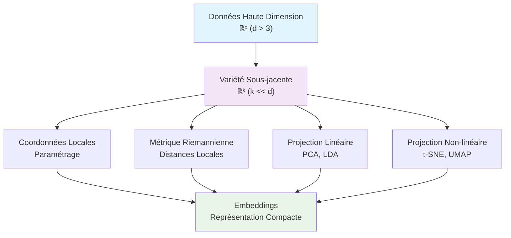

<div className="math-container">

## 🌌 Révéler la Géométrie Cachée

Le **Manifold Learning** révolutionne l'analyse de données en révélant les **variétés** (manifolds) sous-jacentes aux ensembles de données complexes. Cette approche géométrique nous permet de naviguer dans les dimensions cachées et de comprendre la vraie structure de nos données.

</div>

{/* truncate */}

## 🎯 Qu'est-ce qu'une Variété ?

Une **variété** est un espace topologique qui ressemble localement à l'espace euclidien ℝⁿ. En termes simples, c'est une surface "lisse" plongée dans un espace de dimension plus élevée.

### Exemples Intuitifs

- **Sphère** : surface 2D plongée dans l'espace 3D
- **Tore** : surface en forme de donut
- **Ruban de Möbius** : surface à une seule face

## 🔍 Visualisation du Concept



## 📊 Exemple Pratique : Données en Spirale

Considérons des données générées selon une spirale 3D, mais observées dans un espace de dimension plus élevée :

```python
import numpy as np
import matplotlib.pyplot as plt
from sklearn.manifold import TSNE, Isomap, LocallyLinearEmbedding
from sklearn.decomposition import PCA
import seaborn as sns

# Génération de données en spirale 3D
def generate_spiral(n_samples=1000, noise=0.1):
    """Génère des données en spirale 3D"""
    t = np.linspace(0, 4*np.pi, n_samples)
    x = t * np.cos(t) + np.random.normal(0, noise, n_samples)
    y = t * np.sin(t) + np.random.normal(0, noise, n_samples)
    z = t + np.random.normal(0, noise, n_samples)
    return np.column_stack([x, y, z])

# Ajout de dimensions supplémentaires (bruit)
def add_noise_dimensions(data, n_extra_dims=10, noise_level=0.5):
    """Ajoute des dimensions de bruit aux données"""
    n_samples, n_dims = data.shape
    noise = np.random.normal(0, noise_level, (n_samples, n_extra_dims))
    return np.column_stack([data, noise])

# Génération des données
spiral_data = generate_spiral(1000, 0.1)
high_dim_data = add_noise_dimensions(spiral_data, 10, 0.5)

print(f"Données originales : {spiral_data.shape}")
print(f"Données haute dimension : {high_dim_data.shape}")
```

## 🎨 Comparaison des Méthodes de Réduction

```python
# Application de différentes méthodes
methods = {
    'PCA': PCA(n_components=2),
    'Isomap': Isomap(n_components=2, n_neighbors=20),
    'LLE': LocallyLinearEmbedding(n_components=2, n_neighbors=20),
    't-SNE': TSNE(n_components=2, perplexity=30, random_state=42)
}

# Visualisation comparative
fig, axes = plt.subplots(2, 3, figsize=(18, 12))
axes = axes.ravel()

# Données originales
ax = axes[0]
ax = plt.subplot(2, 3, 1, projection='3d')
ax.scatter(spiral_data[:, 0], spiral_data[:, 1], spiral_data[:, 2], 
          c=spiral_data[:, 2], cmap='viridis', alpha=0.6)
ax.set_title('Données Originales (3D)')

# Application des méthodes
for i, (name, method) in enumerate(methods.items()):
    ax = axes[i + 1]
    
    if name == 'PCA':
        # PCA peut être appliquée directement
        embedding = method.fit_transform(high_dim_data)
    else:
        # Autres méthodes nécessitent des données de dimension raisonnable
        embedding = method.fit_transform(high_dim_data)
    
    scatter = ax.scatter(embedding[:, 0], embedding[:, 1], 
                        c=spiral_data[:, 2], cmap='viridis', alpha=0.6)
    ax.set_title(f'{name}')
    ax.set_xlabel('Composante 1')
    ax.set_ylabel('Composante 2')

# Projection 3D → 2D (référence)
ax = axes[5]
ax.scatter(spiral_data[:, 0], spiral_data[:, 1], 
          c=spiral_data[:, 2], cmap='viridis', alpha=0.6)
ax.set_title('Projection 3D → 2D (Référence)')

plt.tight_layout()
plt.show()
```

## 🧠 Algorithmes de Manifold Learning

### 1. **PCA (Analyse en Composantes Principales)**
- **Principe** : Projection linéaire sur les directions de variance maximale
- **Avantages** : Rapide, interprétable, déterministe
- **Limitations** : Ne capture que les relations linéaires

```python
def pca_analysis(data, n_components=2):
    """Analyse PCA complète"""
    pca = PCA(n_components=n_components)
    transformed = pca.fit_transform(data)
    
    print(f"Variance expliquée : {pca.explained_variance_ratio_}")
    print(f"Variance totale : {sum(pca.explained_variance_ratio_):.3f}")
    
    return transformed, pca
```

### 2. **t-SNE (t-Distributed Stochastic Neighbor Embedding)**
- **Principe** : Préservation des voisinages locaux via distributions de probabilité
- **Avantages** : Excellente séparation visuelle des clusters
- **Limitations** : Non déterministe, ne préserve pas les distances globales

```python
def tsne_analysis(data, perplexity=30, learning_rate=200):
    """Analyse t-SNE avec paramètres optimisés"""
    tsne = TSNE(
        n_components=2,
        perplexity=perplexity,
        learning_rate=learning_rate,
        random_state=42,
        n_iter=1000
    )
    
    embedding = tsne.fit_transform(data)
    
    # Métriques de qualité
    kl_divergence = tsne.kl_divergence_
    print(f"Divergence KL finale : {kl_divergence:.3f}")
    
    return embedding
```

### 3. **UMAP (Uniform Manifold Approximation and Projection)**
- **Principe** : Construction d'un graphe de voisinage et optimisation topologique
- **Avantages** : Rapide, préserve les structures locales et globales
- **Limitations** : Sensible aux paramètres

```python
import umap

def umap_analysis(data, n_neighbors=15, min_dist=0.1):
    """Analyse UMAP avec paramètres adaptatifs"""
    reducer = umap.UMAP(
        n_components=2,
        n_neighbors=n_neighbors,
        min_dist=min_dist,
        random_state=42
    )
    
    embedding = reducer.fit_transform(data)
    
    # Métriques de qualité
    trustworthiness = reducer.trustworthiness_
    print(f"Trustworthiness : {trustworthiness:.3f}")
    
    return embedding
```

## 🎯 Applications Pratiques

### 1. **Analyse de Séquences Génétiques**

```python
def analyze_genetic_sequences(sequences):
    """Analyse de séquences ADN avec manifold learning"""
    # Encodage des séquences
    def encode_sequence(seq):
        mapping = {'A': [1, 0, 0, 0], 'T': [0, 1, 0, 0], 
                  'G': [0, 0, 1, 0], 'C': [0, 0, 0, 1]}
        return np.array([mapping[base] for base in seq]).flatten()
    
    # Encodage de toutes les séquences
    encoded_sequences = np.array([encode_sequence(seq) for seq in sequences])
    
    # Réduction de dimension
    umap_embedding = umap.UMAP(n_components=2, random_state=42).fit_transform(encoded_sequences)
    
    return umap_embedding

# Exemple d'utilisation
sequences = ['ATCGATCG', 'GCTAGCTA', 'ATCGATCG', 'TTTTAAAA', 'GGGGCCCC']
embedding = analyze_genetic_sequences(sequences)
```

### 2. **Analyse d'Images Médicales**

```python
def analyze_medical_images(image_data, labels):
    """Analyse d'images médicales avec manifold learning"""
    from sklearn.preprocessing import StandardScaler
    
    # Normalisation des données
    scaler = StandardScaler()
    normalized_data = scaler.fit_transform(image_data.reshape(len(image_data), -1))
    
    # Réduction de dimension
    isomap = Isomap(n_components=2, n_neighbors=20)
    embedding = isomap.fit_transform(normalized_data)
    
    # Visualisation avec labels
    plt.figure(figsize=(10, 8))
    scatter = plt.scatter(embedding[:, 0], embedding[:, 1], c=labels, cmap='tab10', alpha=0.7)
    plt.colorbar(scatter)
    plt.title('Analyse d\'Images Médicales - Isomap')
    plt.xlabel('Composante 1')
    plt.ylabel('Composante 2')
    plt.show()
    
    return embedding
```

## 🔬 Métriques de Qualité

```python
def evaluate_embedding_quality(original_data, embedding, method_name):
    """Évaluation de la qualité d'un embedding"""
    from sklearn.neighbors import NearestNeighbors
    from sklearn.metrics import trustworthiness, continuity
    
    # Métriques de préservation de structure
    trust = trustworthiness(original_data, embedding, n_neighbors=10)
    cont = continuity(original_data, embedding, n_neighbors=10)
    
    # Métriques de voisinage
    nbrs_orig = NearestNeighbors(n_neighbors=10).fit(original_data)
    nbrs_emb = NearestNeighbors(n_neighbors=10).fit(embedding)
    
    distances_orig, indices_orig = nbrs_orig.kneighbors(original_data)
    distances_emb, indices_emb = nbrs_emb.kneighbors(embedding)
    
    # Calcul de la préservation des voisinages
    neighborhood_preservation = 0
    for i in range(len(original_data)):
        common_neighbors = len(set(indices_orig[i]) & set(indices_emb[i]))
        neighborhood_preservation += common_neighbors / 10
    
    neighborhood_preservation /= len(original_data)
    
    print(f"\n=== Qualité de l'embedding ({method_name}) ===")
    print(f"Trustworthiness: {trust:.3f}")
    print(f"Continuity: {cont:.3f}")
    print(f"Préservation des voisinages: {neighborhood_preservation:.3f}")
    
    return {
        'trustworthiness': trust,
        'continuity': cont,
        'neighborhood_preservation': neighborhood_preservation
    }
```

## 🎨 Visualisation Interactive

```python
import plotly.graph_objects as go
from plotly.subplots import make_subplots

def create_interactive_visualization(original_data, embeddings_dict):
    """Création d'une visualisation interactive"""
    fig = make_subplots(
        rows=2, cols=2,
        subplot_titles=list(embeddings_dict.keys()),
        specs=[[{'type': 'scatter'}, {'type': 'scatter'}],
               [{'type': 'scatter'}, {'type': 'scatter'}]]
    )
    
    colors = original_data[:, 2] if original_data.shape[1] > 2 else np.arange(len(original_data))
    
    for i, (method, embedding) in enumerate(embeddings_dict.items()):
        row = (i // 2) + 1
        col = (i % 2) + 1
        
        fig.add_trace(
            go.Scatter(
                x=embedding[:, 0],
                y=embedding[:, 1],
                mode='markers',
                marker=dict(
                    color=colors,
                    colorscale='Viridis',
                    size=5,
                    opacity=0.7
                ),
                name=method,
                showlegend=False
            ),
            row=row, col=col
        )
    
    fig.update_layout(
        title="Comparaison Interactive des Méthodes de Manifold Learning",
        height=800
    )
    
    return fig

# Utilisation
embeddings = {
    'PCA': pca_result,
    't-SNE': tsne_result,
    'UMAP': umap_result,
    'Isomap': isomap_result
}

interactive_fig = create_interactive_visualization(spiral_data, embeddings)
interactive_fig.show()
```

## 🚀 Applications Avancées

### Embeddings pour le Machine Learning

```python
from sklearn.ensemble import RandomForestClassifier
from sklearn.model_selection import cross_val_score

def embedding_as_features(original_data, embedding_data, labels):
    """Utilisation des embeddings comme features pour ML"""
    
    # Modèle sur données originales
    rf_original = RandomForestClassifier(n_estimators=100, random_state=42)
    scores_original = cross_val_score(rf_original, original_data, labels, cv=5)
    
    # Modèle sur embeddings
    rf_embedding = RandomForestClassifier(n_estimators=100, random_state=42)
    scores_embedding = cross_val_score(rf_embedding, embedding_data, labels, cv=5)
    
    print(f"Précision données originales : {scores_original.mean():.3f} ± {scores_original.std():.3f}")
    print(f"Précision embeddings : {scores_embedding.mean():.3f} ± {scores_embedding.std():.3f}")
    
    # Ratio de réduction de dimension
    reduction_ratio = original_data.shape[1] / embedding_data.shape[1]
    print(f"Réduction de dimension : {reduction_ratio:.1f}x")
    
    return scores_original, scores_embedding
```

## 📚 Ressources Complémentaires

- **Théorie complète** : [Manifold Learning](/docs/theory/manifold_learning)
- **Word Embeddings** : [Word Embeddings](/docs/theory/word_embeddings)
- **Graph Embeddings** : [Graph Embeddings & GDL](/docs/theory/graph_embeddings_gdl)
- **Notebooks pratiques** : [Embeddings & ML](https://github.com/Axle-Bucamp/docausorusTopologieExplained/tree/main/docs/notebooks/06_embeddings_ml.ipynb)

## 🎯 Défi Final

**Exercice** : Analyser un dataset de votre choix avec différentes méthodes de manifold learning.

```python
def manifold_learning_challenge(dataset, target_column=None):
    """
    Défi : Comparer différentes méthodes sur un dataset réel
    
    Étapes :
    1. Charger et préparer les données
    2. Appliquer PCA, t-SNE, UMAP, Isomap
    3. Évaluer la qualité de chaque embedding
    4. Visualiser les résultats
    5. Utiliser les embeddings pour la classification
    """
    
    # Préparation des données
    if target_column:
        X = dataset.drop(columns=[target_column])
        y = dataset[target_column]
    else:
        X = dataset
        y = None
    
    # Normalisation
    from sklearn.preprocessing import StandardScaler
    scaler = StandardScaler()
    X_scaled = scaler.fit_transform(X)
    
    # Application des méthodes
    methods = {
        'PCA': PCA(n_components=2),
        't-SNE': TSNE(n_components=2, random_state=42),
        'UMAP': umap.UMAP(n_components=2, random_state=42),
        'Isomap': Isomap(n_components=2, n_neighbors=20)
    }
    
    embeddings = {}
    quality_metrics = {}
    
    for name, method in methods.items():
        print(f"\n=== Application de {name} ===")
        
        # Calcul de l'embedding
        embedding = method.fit_transform(X_scaled)
        embeddings[name] = embedding
        
        # Évaluation de la qualité
        if X_scaled.shape[1] > 2:  # Seulement si on a plus de 2 dimensions
            quality = evaluate_embedding_quality(X_scaled, embedding, name)
            quality_metrics[name] = quality
    
    # Visualisation
    create_comparison_plot(embeddings, y)
    
    # Classification si labels disponibles
    if y is not None:
        print("\n=== Comparaison des performances de classification ===")
        for name, embedding in embeddings.items():
            scores = embedding_as_features(X_scaled, embedding, y)
    
    return embeddings, quality_metrics

# Exemple d'utilisation avec le dataset Iris
from sklearn.datasets import load_iris
iris = load_iris()
iris_df = pd.DataFrame(iris.data, columns=iris.feature_names)
iris_df['species'] = iris.target

embeddings, metrics = manifold_learning_challenge(iris_df, 'species')
```

---

*Le Manifold Learning ouvre une nouvelle dimension dans l'analyse de données complexes. En révélant la géométrie sous-jacente de nos données, il nous permet de naviguer dans les dimensions cachées et de découvrir des structures que les méthodes traditionnelles ne peuvent pas révéler.*
