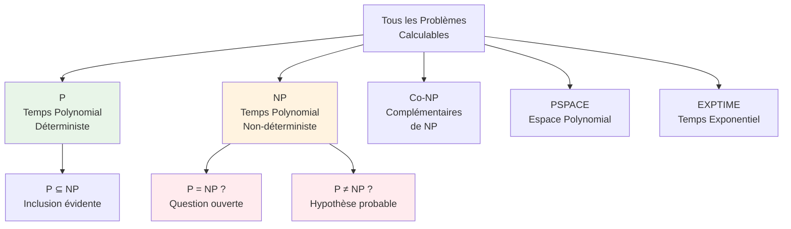

import Tabs from '@theme/Tabs';
import TabItem from '@theme/TabItem';


<div className="math-container">

## 🧩 Le Mystère du Millénaire

Le problème **P vs NP** est l'une des questions les plus importantes en informatique théorique. Résolu, il révolutionnerait notre compréhension de la calculabilité et transformerait notre monde numérique.

</div>

{/* truncate */}

## 🎯 Qu'est-ce que P vs NP ?

### Classes de Complexité

**P** : Problèmes **résolubles en temps polynomial** par une machine de Turing déterministe
- Exemple : tri d'une liste, recherche dans un tableau
- Complexité : $O(n^k)$ où $k$ est une constante

**NP** : Problèmes **vérifiables en temps polynomial** par une machine de Turing non-déterministe
- Exemple : factorisation d'entiers, voyageur de commerce
- Caractéristique : on peut vérifier une solution rapidement

## 🔍 Visualisation du Problème



## 🎮 Exemple Concret : Le Problème du Voyageur de Commerce

Imaginons un représentant commercial qui doit visiter 5 villes en minimisant la distance totale.

### Données du Problème
```python
import numpy as np
import matplotlib.pyplot as plt
from itertools import permutations

# Coordonnées des villes
cities = {
    'Paris': (2.3522, 48.8566),
    'Lyon': (4.8357, 45.7640),
    'Marseille': (5.3698, 43.2965),
    'Toulouse': (1.4442, 43.6047),
    'Nantes': (-1.5536, 47.2184)
}

# Calcul de toutes les permutations possibles
def calculate_distance(city1, city2):
    """Calcule la distance euclidienne entre deux villes"""
    x1, y1 = cities[city1]
    x2, y2 = cities[city2]
    return np.sqrt((x2-x1)**2 + (y2-y1)**2)

def total_distance(route):
    """Calcule la distance totale d'un parcours"""
    total = 0
    for i in range(len(route)-1):
        total += calculate_distance(route[i], route[i+1])
    total += calculate_distance(route[-1], route[0])  # Retour au départ
    return total

# Force brute : essayer toutes les permutations
all_routes = list(permutations(cities.keys()))
best_route = min(all_routes, key=total_distance)
best_distance = total_distance(best_route)

print(f"Meilleur parcours : {' → '.join(best_route)} → {best_route[0]}")
print(f"Distance totale : {best_distance:.2f} unités")
print(f"Nombre de parcours testés : {len(all_routes)}")
```

### Complexité Explosive

Pour **n** villes, il y a **(n-1)!/2** parcours possibles :
- 5 villes : 12 parcours
- 10 villes : 181,440 parcours  
- 20 villes : 6 × 10¹⁶ parcours
- 50 villes : 3 × 10⁶² parcours

## 🧠 Pourquoi P = NP Serait Révolutionnaire

Si **P = NP**, alors :

### ✅ Avantages
- **Cryptographie** : tous les systèmes actuels seraient cassés
- **Optimisation** : résolution rapide de problèmes complexes
- **IA** : algorithmes d'apprentissage automatique plus efficaces
- **Sciences** : simulation de systèmes complexes en temps réel

### ⚠️ Conséquences
- **Sécurité** : fin de la cryptographie basée sur la complexité
- **Économie** : transformation des modèles d'optimisation
- **Recherche** : automatisation de la découverte scientifique

## 📊 Métriques de Complexité

```python
import matplotlib.pyplot as plt
import numpy as np

# Fonctions de complexité
def constant_time(n):
    return 1

def linear_time(n):
    return n

def quadratic_time(n):
    return n**2

def exponential_time(n):
    return 2**n

def factorial_time(n):
    return np.math.factorial(n)

# Visualisation
n_values = np.arange(1, 11)
complexities = {
    'O(1)': [constant_time(n) for n in n_values],
    'O(n)': [linear_time(n) for n in n_values],
    'O(n²)': [quadratic_time(n) for n in n_values],
    'O(2ⁿ)': [exponential_time(n) for n in n_values],
    'O(n!)': [factorial_time(n) for n in n_values]
}

plt.figure(figsize=(12, 8))
for name, values in complexities.items():
    plt.plot(n_values, values, marker='o', label=name, linewidth=2)

plt.xlabel('Taille de l\'entrée (n)')
plt.ylabel('Nombre d\'opérations')
plt.title('Comparaison des Complexités Algorithmiques')
plt.yscale('log')
plt.legend()
plt.grid(True, alpha=0.3)
plt.show()
```

## 🔬 Problèmes NP-Complets

Un problème est **NP-complet** s'il est :
1. **Dans NP** (vérifiable en temps polynomial)
2. **NP-difficile** (au moins aussi difficile que tous les problèmes de NP)

### Exemples Célèbres

<Tabs>
<TabItem value="sat" label="SAT (Satisfiabilité)">

**Problème** : Existe-t-il une assignation de variables qui rend une formule booléenne vraie ?

```python
# Exemple : (x₁ ∨ ¬x₂) ∧ (¬x₁ ∨ x₃) ∧ (x₂ ∨ ¬x₃)
formula = [
    [1, -2],    # x₁ ∨ ¬x₂
    [-1, 3],    # ¬x₁ ∨ x₃  
    [2, -3]     # x₂ ∨ ¬x₃
]

def is_satisfiable(formula, assignment):
    """Vérifie si une assignation satisfait la formule"""
    for clause in formula:
        clause_satisfied = False
        for literal in clause:
            var = abs(literal)
            value = assignment.get(var, None)
            if value is not None:
                if (literal > 0 and value) or (literal < 0 and not value):
                    clause_satisfied = True
                    break
        if not clause_satisfied:
            return False
    return True
```

</TabItem>
<TabItem value="tsp" label="TSP (Voyageur de Commerce)">

**Problème** : Trouver le parcours le plus court visitant chaque ville exactement une fois.

```python
def tsp_brute_force(distances):
    """Résolution par force brute du TSP"""
    n = len(distances)
    min_distance = float('inf')
    best_route = None
    
    # Générer toutes les permutations
    for perm in permutations(range(1, n)):
        route = [0] + list(perm) + [0]  # Commencer et finir à la ville 0
        total_distance = sum(distances[route[i]][route[i+1]] 
                           for i in range(len(route)-1))
        
        if total_distance < min_distance:
            min_distance = total_distance
            best_route = route
    
    return best_route, min_distance
```

</TabItem>
<TabItem value="clique" label="Clique Maximum">

**Problème** : Trouver la plus grande clique (sous-graphe complet) dans un graphe.

```python
def max_clique(graph):
    """Trouve la clique maximum dans un graphe"""
    def is_clique(nodes):
        """Vérifie si un ensemble de nœuds forme une clique"""
        for i in range(len(nodes)):
            for j in range(i+1, len(nodes)):
                if nodes[j] not in graph[nodes[i]]:
                    return False
        return True
    
    max_size = 0
    best_clique = []
    
    # Essayer tous les sous-ensembles de nœuds
    for subset in all_subsets(graph.keys()):
        if is_clique(subset) and len(subset) > max_size:
            max_size = len(subset)
            best_clique = subset
    
    return best_clique, max_size
```

</TabItem>
</Tabs>

## 🎯 Algorithmes d'Approximation

Quand la solution exacte est trop coûteuse, on utilise des **algorithmes d'approximation** :

### Algorithme Greedy pour TSP

```python
def tsp_greedy(distances):
    """Algorithme glouton pour le TSP"""
    n = len(distances)
    unvisited = set(range(1, n))
    current = 0
    route = [0]
    total_distance = 0
    
    while unvisited:
        # Choisir la ville non visitée la plus proche
        nearest = min(unvisited, key=lambda city: distances[current][city])
        total_distance += distances[current][nearest]
        route.append(nearest)
        unvisited.remove(nearest)
        current = nearest
    
    # Retour au point de départ
    total_distance += distances[current][0]
    route.append(0)
    
    return route, total_distance

# Ratio d'approximation
def approximation_ratio(greedy_solution, optimal_solution):
    return greedy_solution / optimal_solution
```

## 🔮 État Actuel de la Recherche

### Preuves Partielles
- **P ≠ PSPACE** : prouvé
- **P ≠ EXPTIME** : prouvé  
- **P ≠ NP** : **non prouvé** (mais largement conjecturé)

### Approches de Recherche
1. **Preuves par circuits** : limitation de la puissance des circuits booléens
2. **Preuves par diagonalisation** : généralisation des arguments de Cantor
3. **Preuves par relativisation** : impossibilité de certaines techniques
4. **Preuves par aléatisation** : séparation de classes probabilistes

## 🛠️ Outils de Recherche

```python
# Simulation de problèmes NP-complets
class NPCompleteSolver:
    def __init__(self, problem_type):
        self.problem_type = problem_type
    
    def solve_exact(self, instance):
        """Résolution exacte (exponentielle)"""
        if self.problem_type == 'SAT':
            return self._solve_sat_exact(instance)
        elif self.problem_type == 'TSP':
            return self._solve_tsp_exact(instance)
    
    def solve_approximation(self, instance, epsilon=0.1):
        """Résolution approchée"""
        if self.problem_type == 'TSP':
            return self._solve_tsp_approx(instance, epsilon)
    
    def verify_solution(self, instance, solution):
        """Vérification en temps polynomial"""
        # Implémentation spécifique selon le problème
        pass
```

## 📚 Ressources Complémentaires

- **Théorie complète** : [Fondements de la Complexité](/docs/theory/11_complexite_fondements)
- **P vs NP détaillé** : [P vs NP](/docs/theory/12_p_vs_np)
- **Algorithmes d'approximation** : [Approximation et Heuristiques](/docs/theory/13_approximation_heuristiques)
- **Notebooks pratiques** : [Complexité P vs NP](/docs/notebooks/04_p_vs_np_complexite)

## 🎯 Défi Final

**Exercice** : Implémentez un solveur SAT simple et mesurez sa complexité sur différentes instances.

```python
def solve_sat_challenge(formula):
    """
    Défi : Résoudre une formule SAT en temps exponentiel
    Retourner : (solution, temps_calcul, nombre_assignations_testées)
    """
    import time
    start_time = time.time()
    
    variables = set()
    for clause in formula:
        for literal in clause:
            variables.add(abs(literal))
    
    variables = list(variables)
    n = len(variables)
    assignments_tested = 0
    
    # Force brute : tester toutes les assignations
    for i in range(2**n):
        assignment = {}
        for j, var in enumerate(variables):
            assignment[var] = bool(i & (1 << j))
        
        assignments_tested += 1
        
        if is_satisfiable(formula, assignment):
            end_time = time.time()
            return assignment, end_time - start_time, assignments_tested
    
    end_time = time.time()
    return None, end_time - start_time, assignments_tested

# Test sur différentes tailles
for n_vars in [5, 10, 15]:
    test_formula = generate_random_sat(n_vars, n_vars * 3)
    solution, time_taken, assignments = solve_sat_challenge(test_formula)
    print(f"Variables: {n_vars}, Temps: {time_taken:.4f}s, Assignations: {assignments}")
```

---

*Le problème P vs NP reste l'un des plus grands mystères des mathématiques modernes. Sa résolution transformerait notre compréhension de la calculabilité et aurait des implications profondes sur notre société numérique.*
