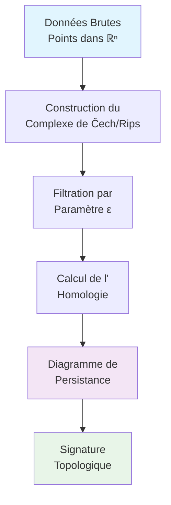

import Tabs from '@theme/Tabs';
import TabItem from '@theme/TabItem';


<div className="math-container">

## 🌌 Découvrir la Structure Cachée de vos Données

L'Analyse Topologique des Données (TDA) révolutionne notre compréhension des ensembles de données complexes. Cette approche géométrique révèle les **structures topologiques** persistantes qui échappent aux méthodes traditionnelles.

</div>

{/* truncate */}

## 🎯 Qu'est-ce que la TDA ?

La TDA utilise des outils de topologie algébrique pour étudier la "forme" des données. Contrairement aux statistiques classiques, elle se concentre sur les **relations spatiales** et les **connexions** entre les points de données.

### Concepts Fondamentaux

- **Simplexes** : généralisation des triangles et tétraèdres
- **Complexes simpliciaux** : collections de simplexes
- **Homologie persistante** : étude de la structure à différentes échelles

## 📊 Exemple Pratique : Classification d'Images

Considérons un problème de classification d'images médicales. Voici comment la TDA peut révéler des structures cachées :

```python
import numpy as np
import matplotlib.pyplot as plt
from sklearn.datasets import make_circles, make_moons
from ripser import ripser
from ripser.plotting import plot_diagram

# Génération de données complexes
X_circles, _ = make_circles(n_samples=100, noise=0.1, factor=0.3)
X_moons, _ = make_moons(n_samples=100, noise=0.1)

# Calcul de l'homologie persistante
diagrams_circles = ripser(X_circles)['dgms']
diagrams_moons = ripser(X_moons)['dgms']

# Visualisation
fig, axes = plt.subplots(2, 2, figsize=(12, 10))

# Données originales
axes[0,0].scatter(X_circles[:,0], X_circles[:,1], alpha=0.6)
axes[0,0].set_title('Données en Cercles')

axes[0,1].scatter(X_moons[:,0], X_moons[:,1], alpha=0.6)
axes[0,1].set_title('Données en Lunes')

# Diagrammes de persistance
plot_diagram(diagrams_circles[1], ax=axes[1,0])
axes[1,0].set_title('Persistance - Cercles')

plot_diagram(diagrams_moons[1], ax=axes[1,1])
axes[1,1].set_title('Persistance - Lunes')

plt.tight_layout()
plt.show()
```

## 🔬 Visualisation des Structures Topologiques



## 🎨 Applications Réelles

### 1. **Biologie Computationnelle**
- Analyse de structures protéiques
- Classification de séquences ADN
- Détection de motifs dans les réseaux biologiques

### 2. **Machine Learning**
- Feature engineering topologique
- Détection d'anomalies
- Réduction de dimension non-linéaire

### 3. **Imagerie Médicale**
- Segmentation d'organes
- Détection de tumeurs
- Analyse de réseaux vasculaires

## 📈 Métriques de Persistance

La **persistance** d'une caractéristique topologique se mesure par sa durée de vie dans la filtration :

```math
p = d_death - d_birth
```

où d_birth et d_death sont les paramètres où la caractéristique apparaît et disparaît.

## 🛠️ Outils et Bibliothèques

<Tabs>
<TabItem value="python" label="Python">

```python
# Bibliothèques principales
import ripser           # Calcul de l'homologie persistante
import gudhi           # Complexes simpliciaux
import sklearn_tda     # Intégration avec scikit-learn
import persim          # Visualisation et métriques
```

</TabItem>
<TabItem value="r" label="R">

```r
# Packages R pour la TDA
library(TDA)           # Fonctions de base
library(TDAstats)      # Statistiques sur la TDA
library(ggplot2)       # Visualisation
```

</TabItem>
<TabItem value="julia" label="Julia">

```julia
# Écosystème Julia
using Ripserer         # Calculs rapides
using PersistenceDiagrams
using Plots            # Visualisation
```

</TabItem>
</Tabs>

## 🎯 Défi Pratique

**Exercice** : Analyser la structure topologique d'un jeu de données de votre choix.

1. **Choisissez un dataset** (iris, digits, ou vos propres données)
2. **Calculez l'homologie persistante**
3. **Visualisez les diagrammes de persistance**
4. **Interprétez les structures détectées**

```python
# Template de solution
def analyze_topology(X, max_dim=2):
    """
    Analyse topologique complète d'un dataset
    """
    # Calcul de l'homologie persistante
    diagrams = ripser(X, maxdim=max_dim)['dgms']
    
    # Visualisation
    fig, axes = plt.subplots(1, max_dim, figsize=(5*max_dim, 5))
    for i, ax in enumerate(axes):
        plot_diagram(diagrams[i], ax=ax)
        ax.set_title(f'Homologie H{i}')
    
    return diagrams

# Application
from sklearn.datasets import load_iris
iris = load_iris()
diagrams = analyze_topology(iris.data)
```

## 🔮 Perspectives d'Avenir

La TDA continue d'évoluer avec :
- **Deep Learning topologique** : intégration avec les réseaux de neurones
- **TDA quantique** : applications en informatique quantique
- **TDA temps réel** : analyse de flux de données

## 📚 Ressources Complémentaires

- **Cours complet** : [Topological Data Analysis](/docs/theory/topological_data_analysis)
- **Applications** : [TDA Applications](/docs/theory/tda_applications)

---

*L'analyse topologique des données ouvre une nouvelle dimension dans l'exploration des données complexes. En révélant les structures géométriques cachées, elle nous permet de comprendre des phénomènes que les méthodes traditionnelles ne peuvent pas capturer.*
